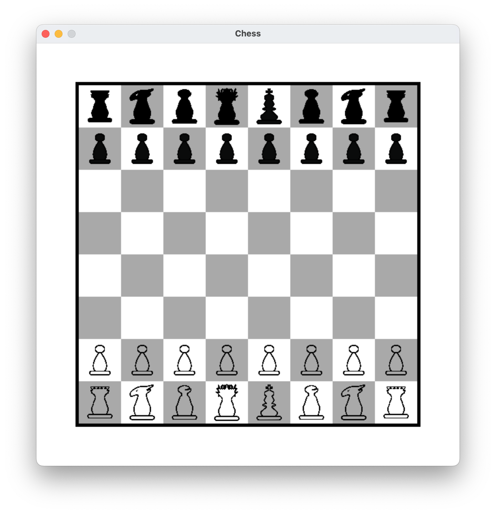
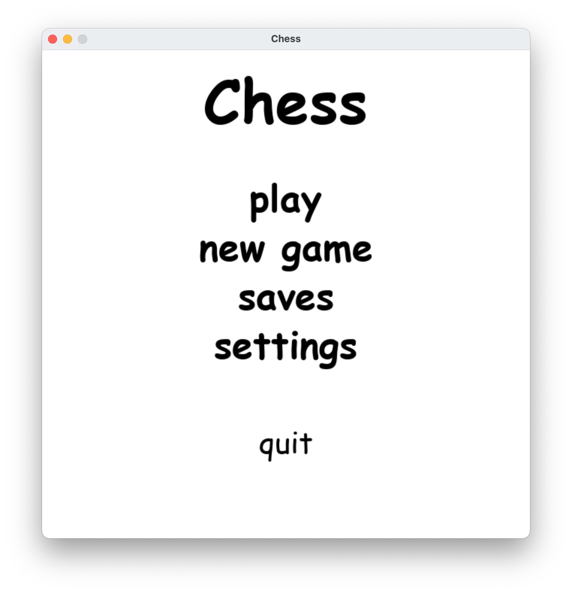

# PythonChess !
[size](https://img.shields.io/github/repo-size/Hardcode3/PyChess) 
A pygame wrapper for the [stockfish chess engine](https://stockfishchess.org).
For more details, check their [GitHub repository](https://github.com/official-stockfish/Stockfish).
The wrapper is based on the python package [stockfish](https://github.com/zhelyabuzhsky/stockfish.git).
The view is developped using my pygame-toolkit, helping to create gui-like views in pygame.

# Cloning
Stockfish is not cloned as a submodule, clone it as follows:
```
git clone https://github.com/Hardcode3/PyChess.git
```
The content of the repository corresponding to the official realease is located under the [chess/external/stockfish path](chess/external/stockfish/).
Consider checking their [website](https://stockfishchess.org).

# Launchin the app
To run the app, create a virtual environment or pip install the [requirements](requirements.txt).
## To create and activate a virtual environment on UNIX like systems
```
python3 -m venv venv
source venv/bin/activate
```
## To install the dependencies
```
pip install -r requirements.txt
```
After this step, pip should have installed the dependencies and you should be able to launch the main program using:
```
python3 main.py
```
Note that the [main.py](main.py) file handles the compilation of the [Stockfish](https://stockfishchess.org) code.
If a stockfish executable is found, skip the compilation process, otherwise compile and download necessary files using the included [Makefile](chess/external/stockfish/src/Makefile).
The game launches automatically after the process is done.

# Compatibility
This version is only compatible with UNIX systems for the moment since the script for windows is not yet written.
[Stockfish for python](https://pypi.org/project/stockfish/) uses the compiled executable file available in [chess/external/src/](chess/external/src) as stockfish).

# Future improvements
- [ ] Crossplatform app
- [ ] Automatic configuration and tests of Stockfish and the a app

# Screenshots


